# PharmaAssist – Complete Functional, Technical, Data, AI/ML and Research Specification

## 1. Document control

| Field | Value |
| ----- | ----- |
| Document title | PharmaAssist – Complete Functional, Technical, Data, AI/ML and Research Specification |
| Project name | PharmaAssist (CSCK700 Capstone) |
| Document type | As-built functional, technical, data, AI/ML and research specification |
| Version | 1.0 |
| Date generated | 4 August 2026 |
| Repository path | `D:\Projects\PharmaAssist` |
| Branch name | **Not found or not verifiable from the current repository** (`git` not available on PATH during inspection) |
| Commit hash | **Not found or not verifiable from the current repository** |
| Prepared through | Codebase inspection of frontend, backend, models, migrations, OCR/services, research evaluation, Docker, tests and existing `docs/` artefacts |
| Intended audience | Dissertation assessors, supervisors, software handover, architecture review, QA, research-question traceability, healthcare AI safety review |
| Document status | Draft for academic and technical review (as-built) |
| Approved Spec reference | *Design and Evaluation of an AI-Powered Pharma Assistant* (Specification and Design Report) v1.0; ethics **18274**; SHA-256 `fde3eac1d146f7171b64bb949a3c20425af2e33b1998cb4a76b3e0c491c1d91f` (`docs/approved-specification/specification_manifest.json`) |
| Author (project) | Muhammad Zohaib · student number 200052400 · University of Liverpool · MSc Information Systems Management |
| Language | British English |

### Revision history

| Version | Date | Author / method | Summary |
| ------- | ---- | --------------- | ------- |
| 1.0 | 4 August 2026 | Codebase inspection (as-built audit) | Initial complete as-built specification |

### Approval / sign-off placeholders

| Role | Name | Signature | Date |
| ---- | ---- | --------- | ---- |
| Student / author | | | |
| Academic supervisor | | | |
| Technical reviewer | | | |
| Clinical / safety reviewer (optional) | | | |

**Evidence classification key used throughout:** Code-verified · Configuration-verified · Test-verified · Data-verified · Document-only · Inferred · Not verifiable.

---

## 2. Executive summary

PharmaAssist is a pharmacist-facing **human-in-the-loop (HITL) clinical decision-support research prototype** developed for the University of Liverpool CSCK700 capstone. It addresses the operational and research problem of **illegible or ambiguous handwritten prescriptions** by combining OCR, trusted drug-knowledge matching (FDA NDC, FDA SPL, DrugBank-derived catalogue), structured field verification, optional therapeutic-candidate ranking, and a separate research-evaluation layer (DQ1–DQ4).

**What the system does (as-built):** authenticates administrators, pharmacists and reviewers; allows pharmacist registration with consent; accepts prescription image upload; runs a configurable multi-engine OCR stack; extracts medicine lines and SIG-like fields; matches candidates against a local SQLite medicine catalogue; presents a cascade HITL verification table; gates therapeutic evaluation behind pharmacist Confirm; records HITL and therapeutic audit events; and provides reviewer APIs/UI for OCR and recommendation evaluation metrics.

**What the system does not do:** it does not diagnose, prescribe, authorise dispensing, replace pharmacist professional judgement, or claim therapeutic equivalence from MCS alone. It is **not** production-ready clinical software.

**OCR posture (critical):** production default (`OCR_PROFILE=production`) uses **Google Cloud Vision as primary**, with Tesseract fallback and optional TrOCR crop retry. A Spec-aligned profile (`OCR_PROFILE=spec`) runs **TrOCR → Vision → Tesseract** for research runs. Mock OCR may appear in development when engines fail.

**Maturity verdict (evidence-based):** **research / academic prototype (MVP-class HITL + evaluation harness), not a pilot clinical system and not production-ready.** Key strengths: dual-path OCR contract, fail-closed Confirm gate, encrypted temporary images, RBAC, catalogue-backed evidence, DQ1–DQ4 evaluation schema. Material limitations: study ground truth incomplete (`IMPLEMENTED_NOT_EVALUATED`); Spec architecture (Streamlit/HF) superseded by React+FastAPI+Docker; FAISS/BERTScore/SHAP/Groq largely optional; dose/frequency often from curated templates; frontend test suite absent; health tests observed failing in one local run.

**Explicit safety statement:** PharmaAssist **supports, rather than replaces**, the pharmacist’s professional judgement. All clinically consequential outputs require pharmacist review and confirmation before downstream candidate-alternative evaluation.

---

## 3. Project background and problem statement

Handwritten prescriptions remain a known source of medication interpretation risk. Misread drug names, strengths, routes or frequencies can propagate into dispensing errors. Evidence-backed matching against trusted datasets (FDA NDC product identity, FDA SPL labelling text, DrugBank-derived identifiers) can assist pharmacists, but automated OCR and retrieval are fallible.

PharmaAssist therefore centres **HITL verification**: OCR and matching propose structured fields and evidence; the pharmacist corrects and confirms; only then may therapeutic candidate lists and research metrics be derived. The academic contribution is an implementable artefact that can answer approved design questions (DQ1–DQ4) once study data are deposited, while documenting honest divergences from the approved Spec Design Report (architecture platform, OCR primary engine, RAG/XAI emphasis).

**Constraints:** ethics application 18274; synthetic/study-oriented prescriptions preferred; Spec PDF is **not** a clinical knowledge source (`clinical_knowledge_source: false` in the specification manifest); runtime clinical evidence is limited to catalogue-backed FDA/DrugBank-derived content.

---

## 4. Scope

### 4.1 In scope (verified capabilities)

- JWT authentication with Argon2 password hashing; roles administrator / pharmacist / reviewer (**Code-verified**: `backend/app/core/enums.py`, `backend/app/api/v1/auth.py`).
- Pharmacist self-registration with PIS/consent documents and administrator approve/reject (**Code-verified**: `registration.py`, `admin.py`, `consent_docs.py`).
- Prescription image upload with size/type checks; encrypted local temporary storage; retention/purge (**Code-verified**: `prescriptions.py`, storage/encryption/retention services).
- Image preprocessing flags (deskew, ink isolate, binarise, sharpen) (**Code-verified**: `ocr/preprocess.py`).
- Multi-engine OCR stack with dual profiles, optional Paddle detection, optional hybrid consensus, mock fallback (**Code-verified**: `ocr/engines.py`, `ocr/contract.py`, `ocr/consensus.py`, `ocr/tesseract_adapter.py`).
- Medicine-line parsing, formulary/catalogue suggestion, HITL field cascade and Confirm gate (**Code-verified**: `pipeline.py`, `field_verification.py`, frontend Analyzer / VerificationTable).
- Therapeutic alternatives evaluation for **confirmed** medicines with mandatory filters, salt normalisation, dual candidate lists, keyword SPL evidence, optional MCS/SHAP/Groq (**Code-verified**: `therapeutic/`, config flags).
- Summary analytics per session; admin operational views (**Code-verified**: `analytics.py`, `admin.py`).
- Research evaluation APIs and reviewer UI for DQ1–DQ4 harness (**Code-verified**: `research_eval.py`, `ResearchEvaluationPanel.tsx`, `models/research_eval.py`).
- Docker Compose deployment of Postgres + API + web (**Configuration-verified**: `docker-compose.yml`).

### 4.2 Out of scope (unsupported / excluded)

- Autonomous diagnosis, prescribing or dispensing authorisation (**Document-only / Code-verified** safety copy and Confirm gates).
- Claiming MCS-derived “therapeutic equivalence” as regulatory TE (**Document-only**: `specification_traceability_matrix.md` R28).
- Serving the Spec PDF as clinical evidence or in-app governance viewer (removed/out of MVP; manifest only).
- In-app DQ4 Likert questionnaire as primary capture path (external Forms; import-only).
- Live OpenFDA network validation at Confirm (catalogue-local NDC fields; soft provenance).
- Frontend automated test suite (**Not found** in `frontend/package.json`).

### 4.3 Assumptions

- Operators supply dataset files and build `medicine_catalog.sqlite3` before full catalogue features work.
- Google Vision credentials, Tesseract binary and/or TrOCR weights are environment-dependent.
- Study pharmacists use synthetic or ethics-approved images; production clinical deployment is not assumed.
- Approved research questions remain those in the Spec / `research_question_alignment.md` (not rewritten here).

### 4.4 Dependencies

- PostgreSQL for application state; SQLite catalogue for medicines/labels.
- Optional: Google Vision API, Tesseract, PyTorch/Transformers (TrOCR), PaddleOCR, bert-score, RDKit, SHAP, Groq.
- Node.js/npm for frontend; Python 3 virtualenv for backend.

### 4.5 Constraints

- Ethics 18274; privacy-minimising temporary image retention; RBAC.
- Capstone timebox; dual-path OCR chosen to reconcile Spec wording with operational Vision primary.
- No re-platforming to Streamlit/HF Spaces (**Document-only** conflict register).

### 4.6 Known limitations

- DQ readiness: `IMPLEMENTED_NOT_EVALUATED` until ground truth / gold / survey imports complete.
- Claims of “143 prescriptions / 10 pharmacists” are **Not verifiable**.
- Per-field OCR-engine provenance incomplete (R03 gap).
- Mock OCR and synthetic evaluation noise paths exist for development/reproducibility.
- `test_health.py` observed failing locally (AttributeError) during inspection run — see §32.

---

## 5. Stakeholders, actors and user roles

### Verified actors

| Role | Responsibilities | Permitted actions | Restricted actions | Verification / approval | Touchpoints |
| ---- | ---------------- | ----------------- | ------------------ | ----------------------- | ----------- |
| **administrator** | Approve/reject registrations; operational dashboard; retention purge; catalogue/prescriptions overview | Admin APIs and `/admin` UI | Pharmacist Analyzer clinical Confirm workflow; research eval DQ runner (reviewer-gated) | Registration decisions | `/admin`, `/api/v1/admin/*` |
| **pharmacist** | Upload Rx; OCR; HITL verify/confirm; therapeutic decisions; catalogue explore | Analyzer, catalog, clinical/therapeutic APIs | Admin registration decisions; research eval write APIs | Confirm fields; therapeutic decision | `/analyzer`, `/catalog` |
| **reviewer** | Research evaluation snapshots, DQ1–DQ4 harness, export | `/research/evaluation`, `/api/v1/research/eval/*`, evaluation-snapshot | Pharmacist Confirm pipeline (unless also pharmacist account) | Freezes snapshots; imports survey | Research Evaluation panel |
| **Unauthenticated visitor** | Login, register, forgot-password, read PIS/consent | Public auth/consent routes | All clinical and admin APIs | — | `/login`, `/register` |

**Multiple roles are truly supported** (three roles in `UserRole`). There is **no** separate patient portal role. “Researcher” is operationalised as **reviewer**, not a fourth role.

### Role–permission matrix (summary)

| Capability | Admin | Pharmacist | Reviewer | Public |
| ---------- | :---: | :--------: | :------: | :----: |
| Login / change password | ✓ | ✓ | ✓ | Login only |
| Register pharmacist | | request | | ✓ |
| Approve registration | ✓ | | | |
| Upload / OCR / HITL | | ✓ | | |
| Therapeutic evaluate | | ✓ | | |
| Research DQ APIs | | | ✓ | |
| Retention purge | ✓ | | | |

---

## 6. Glossary and abbreviations

| Term | Meaning in this project |
| ---- | ----------------------- |
| OCR | Optical character recognition of prescription images |
| TrOCR | Transformer-based OCR model path used in Spec profile and crop retry |
| CER | Character Error Rate |
| WER | Word Error Rate |
| BERTScore | Optional semantic similarity metric for DQ3 |
| HITL | Human-in-the-loop pharmacist verification |
| NDC | National Drug Code (FDA product identity in catalogue) |
| SPL | Structured Product Labelling (FDA label text sections) |
| DrugBank | Drug knowledge XML source ingested into catalogue |
| PII | Personally identifiable information |
| API | Application programming interface (`/api/v1`) |
| ETL | Extract–transform–load into `medicine_catalog.sqlite3` |
| DFD | Data-flow diagram |
| ERD | Entity-relationship diagram |
| CDS | Clinical decision support (assistive, not autonomous) |
| Confidence score | OCR/parser numeric confidence associated with outputs |
| Ground truth | Pharmacist-confirmed reference for evaluation |
| Normalisation | Canonicalisation of names, salts, units, routes |
| Consensus | Optional hybrid merge of engine outputs (`OCR_HYBRID_CONSENSUS_ENABLED`) |
| Fallback engine | Next engine in configured order when prior fails/low confidence |
| MCS | Maximum Common Substructure (RDKit) used as supporting evidence after mandatory filters |
| SIG | Directions for use (dose/frequency templates) |
| DQ1–DQ4 | Approved design/research questions for evaluation |

---

## 7. Complete system overview

Major components: **React SPA (web)**, **FastAPI API**, **PostgreSQL**, **SQLite medicine catalogue**, **local encrypted file storage**, optional **Google Vision / Tesseract / TrOCR / Paddle**, optional **Groq**, and **research evaluation** tables/UI separate from production HITL.

Trust boundaries: browser ↔ API (JWT); API ↔ Postgres; API ↔ local catalogue/files; API ↔ external OCR providers (images/text leave the host when Vision is used). Research/evaluation is reviewer-gated and uses `research.*` schema. Development enables mock OCR more readily than locked production configuration.

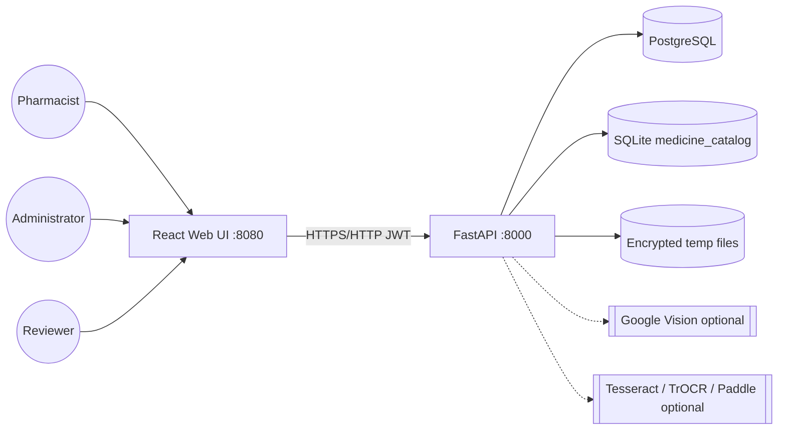

---

## 8. Technology stack

| Layer | Technology | Version | Purpose | Evidence |
| ----- | ---------- | ------: | ------- | -------- |
| Frontend UI | React | ^19.1.0 | SPA | `frontend/package.json` |
| Frontend UI kit | MUI | ^7.0.2 | Components | `frontend/package.json` |
| Frontend build | Vite | ^6.3.2 | Bundler | `frontend/package.json` |
| Frontend language | TypeScript | ~5.8.3 | Typing | `frontend/package.json` |
| Frontend data | TanStack Query / axios | ^5.74.4 / ^1.8.4 | API client | `frontend/package.json` |
| Backend API | FastAPI | 0.128.0 | REST API | `backend/requirements.txt` |
| ASGI server | uvicorn | 0.40.0 | Serve API | `backend/requirements.txt` |
| ORM | SQLAlchemy | 2.0.45 | Persistence | `backend/requirements.txt` |
| Migrations | Alembic | 1.16.5 | Schema evolution | `backend/requirements.txt` |
| Database | PostgreSQL | 16-alpine (compose) | App DB | `docker-compose.yml` |
| DB driver | psycopg | 3.2.13 | Postgres driver | `backend/requirements.txt` |
| Auth crypto | PyJWT / argon2-cffi | 2.10.1 / 25.1.0 | Tokens / passwords | `backend/requirements.txt` |
| Field/file crypto | cryptography | 46.0.0 | AES-GCM storage | `backend/requirements.txt` |
| Image | Pillow / OpenCV headless | 11.3.0 / 4.12.0.88 | Preprocess | `backend/requirements.txt` |
| OCR local | pytesseract | 0.3.13 | Tesseract adapter | `backend/requirements.txt` |
| Fuzzy match | rapidfuzz | 3.14.3 | Catalogue suggest | `backend/requirements.txt` |
| Testing | pytest / httpx | 9.0.2 / 0.28.1 | Backend tests | `backend/requirements.txt` |
| Containerisation | Docker Compose | project file | Local full stack | `docker-compose.yml` |
| Catalogue | SQLite | file DB | Medicines/SPL sections | `MEDICINE_CATALOG_DB` / `data/medicine_catalog.sqlite3` |
| Optional NLP | bert-score / transformers / torch | optional extras | DQ3 / TrOCR | comments / optional reqs |
| Optional chem | RDKit | optional | MCS | `ENABLE_SPEC_MCS` |
| Optional XAI | SHAP | optional | DQ4 condition B | `ENABLE_SPEC_SHAP` |

---

## 9. Application architecture

**Pattern:** layered modular monolith — React SPA + FastAPI API + SQLAlchemy repositories/services + dataset adapters + OCR adapters + research_eval subsystem.

**Frontend structure:** pages under `frontend/src/pages`, shared components (e.g. `VerificationTable`, `ResearchEvaluationPanel`), auth context, API modules.

**Backend layering:** `api/v1` → services (`pipeline`, `field_verification`, `ocr/*`, `therapeutic/*`, `research_eval/*`, datasets) → models → PostgreSQL / SQLite / filesystem.

**OCR abstraction:** `EngineAttempt` contract (`ocr/contract.py`); `run_ocr_stack` orchestration; optional `page_consensus`.

**Evaluation subsystem:** `research.*` models + `/research/eval` APIs + reviewer panel; distinct from pharmacist Analyzer analytics.

**Configuration:** Pydantic `Settings` in `backend/app/core/config.py` with env / `.env` precedence; Compose injects runtime env.

**Tight coupling / inconsistencies:** production OCR primary diverges from Spec TrOCR-primary (documented dual-path); legacy phase-4 alternatives coexist with phase-5 therapeutic engine; Spec Streamlit UI not present.

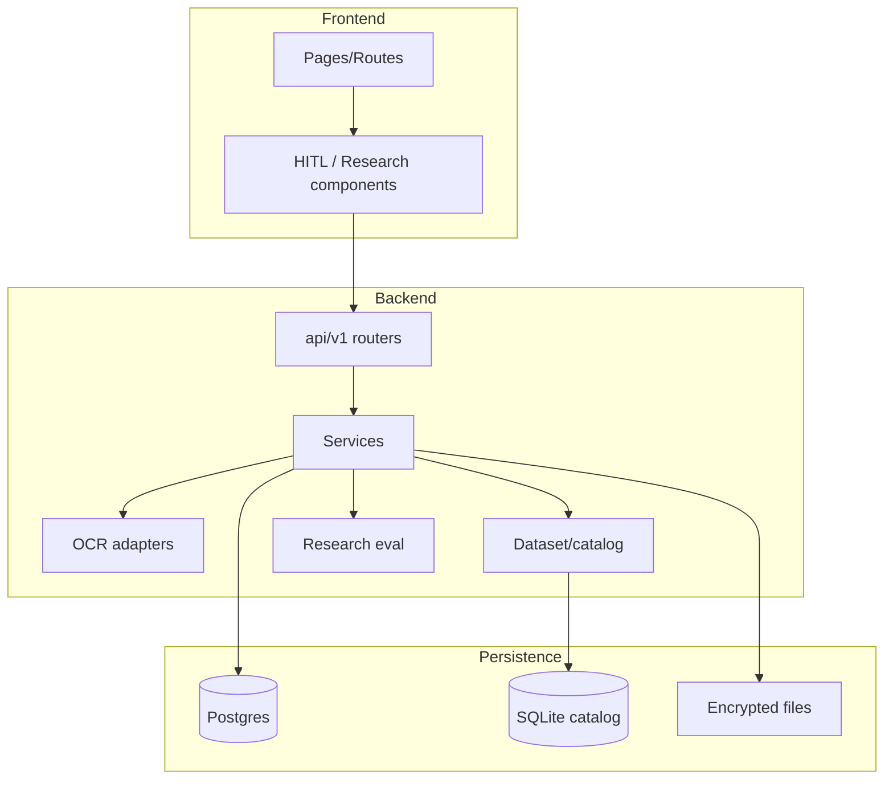

### Repository-directory map (selected)

| Path | Responsibility |
| ---- | -------------- |
| `frontend/src` | UI routes, pages, components |
| `backend/app/api/v1` | HTTP endpoints |
| `backend/app/services` | Pipeline, HITL, OCR, therapeutic, datasets, research |
| `backend/app/models` | ORM entities |
| `backend/alembic/versions` | Migrations 0001–0012 |
| `data/` | Raw datasets + catalogue + research_evaluation seeds |
| `docs/` | Traceability, protocols, this specification |
| `docker-compose.yml` | Compose topology |
| `storage/` | Temporary encrypted blobs (runtime) |

---

## 10. UI and UX specification

### Complete route table

| Route | Screen | Actor | Purpose | Evidence |
| ----- | ------ | ----- | ------- | -------- |
| `/login` | Login | Public | Authenticate | `App.tsx`, `LoginPage` |
| `/register` | Registration | Public / pharmacist applicant | Consent + register | `Register` page |
| `/forgot-password` | Forgot password | Public | Temporary password flow (no email) | Auth pages |
| `/registration-status` | Status | Applicant | Pending/rejected | Status page |
| `/change-password` | Change password | Authenticated | Forced/voluntary change | Auth |
| `/` | Home redirect | Active user | Role home | `homePath.ts` |
| `/admin` | Admin portal | Administrator | Dashboard, registrations, catalog, Rx, analytics | `AdminPortalPage` |
| `/admin/registrations` | Redirect | Administrator | Tab deep-link | `App.tsx` |
| `/analyzer` | Prescription Analyzer | Pharmacist | Upload→OCR→HITL→therapeutics→analytics | Analyzer page |
| `/catalog` | Catalogue explorer | Pharmacist | Browse/suggest medicines | `CatalogExplorerPage` |
| `/research/evaluation` | Research Evaluation | Reviewer | DQ1–DQ4 panel | `ReviewerDashboardPage` + `ResearchEvaluationPanel` |
| `*` | Fallback | — | Redirect login/home | `App.tsx` |

```mermaid
flowchart TD
  Login[/login] --> Home[/]
  Home -->|admin| Admin[/admin]
  Home -->|pharmacist| Analyzer[/analyzer]
  Home -->|reviewer| Research[/research/evaluation]
  Analyzer --> Catalog[/catalog]
  Register[/register] --> Status[/registration-status]
```

### Prescription Analyzer (primary workflow UI)

- **Purpose:** end-to-end pharmacist HITL analysis.
- **Major components:** upload control, image preview, OCR run controls, verification table (drug→route→strength→dose→frequency ± indication), Confirm, therapeutic results, analytics.
- **API dependencies:** `/prescriptions/upload`, OCR run endpoints, verification-table, fields, confirm-fields, therapeutic-alternatives/evaluate, analytics.
- **Loading / empty / error / success:** driven by React Query/axios states (**Code-verified** pattern; exact copy **Inferred** per component).
- **Non-functional / mocked:** mock OCR banner when `is_mock`; Confirm blocked unless `HITL_ALLOW_MOCK_CONFIRM`.

### Other screens (summary)

| Screen | Notes | Status |
| ------ | ----- | ------ |
| Admin portal | Multi-tab operational UI | Implemented |
| Catalogue explorer | Suggest/lookup against SQLite | Implemented (config-dependent on catalogue file) |
| Research Evaluation | Tabs: Dataset & GT, DQ1–DQ4, Combined & export | Implemented (data incomplete for study results) |
| Dedicated Settings page | **Not found** as standalone product settings UI | Not implemented / Not verifiable as separate route |
| Patient portal | **Not found** | Not implemented |

### UI-to-API mapping (high level)

| UI action | API |
| --------- | --- |
| Login | `POST /api/v1/auth/login` |
| Upload Rx | `POST /api/v1/prescriptions/upload` |
| Run OCR | `POST /api/v1/ocr/{session_id}/run` (or async) |
| Load verification | `GET /api/v1/reviews/{session_id}/verification-table` |
| Edit field | `POST .../medicines/{id}/fields` |
| Confirm | `POST .../confirm-fields` |
| Evaluate alternatives | `POST /api/v1/therapeutic-alternatives/evaluate` |
| DQ1 run | `POST /api/v1/research/eval/dq1/run/{case_id}` |

### Form-field data dictionary (selected)

| Form | Field | Required | Source / validation | Evidence |
| ---- | ----- | -------- | ------------------- | -------- |
| Login | username, password | Yes | Auth service | auth API |
| Register | registration fields + consent affirmations | Yes | Registration + consent versions | registration/consent |
| Upload | image file | Yes | MIME/size `MAX_UPLOAD_BYTES` | prescriptions upload |
| HITL | drug, route, strength, dose, frequency | Yes for Confirm | Catalogue options / fail-closed templates | `field_verification.py` |
| HITL | indication | Optional / catalog pick | Not reliably from OCR | R03 notes |
| Therapeutic context | allergies, conditions, etc. | Request-dependent | Request body (not patient ORM) | therapeutic API |

---

## 11. Functional feature specification

Status values used below: Implemented · Implemented but configuration-dependent · Partially implemented · Mocked · Not implemented.

### F01 — Prescription image upload
| Attribute | Detail |
| --------- | ------ |
| Feature ID | F01 |
| Description | Pharmacist uploads a prescription image to create a review session |
| User story | As a pharmacist, I upload an image so OCR and HITL can begin |
| Actor | Pharmacist |
| Preconditions | Active pharmacist session |
| Trigger | Upload control on Analyzer |
| Main flow | Select file → validate → encrypt store → create `ReviewSession` status `uploaded` |
| Alternative | Async OCR later |
| Exception | Unsupported type / oversize → error |
| Inputs | Image bytes, filename, content type |
| Outputs | `ReviewSessionOut` |
| Data persisted | `prescription.review_sessions`, `security.temporary_file_records` |
| API | `POST /api/v1/prescriptions/upload` |
| Security | Auth + upload limits + encryption |
| Status | Implemented |
| Evidence | `backend/app/api/v1/prescriptions.py`, `models/prescription.py` |
| Acceptance | Given valid JPEG/PNG under limit, When uploaded, Then session id returned and encrypted object key set |

### F02 — File validation
MIME/size validation via upload path and `POST /ocr/validate-image`. **Status:** Implemented. **Evidence:** `datasets.py`, `MAX_UPLOAD_BYTES` in `config.py`.

### F03 — Image preview
Analyzer displays session image via `GET /prescriptions/{session_id}/image`. **Status:** Implemented.

### F04 — Image preprocessing
Deskew / ink isolate / binarise / sharpen / max side via `OCR_PREPROCESS_*`. **Status:** Implemented but configuration-dependent. **Evidence:** `ocr/preprocess.py`.

### F05 — OCR execution (multi-engine)
`run_ocr_stack` with profile-selected order. **Status:** Implemented but configuration-dependent. **Evidence:** `ocr/engines.py`.

### F06 — OCR fallback
Sequential fallback per `OCR_FALLBACK_ORDER` / Spec order. **Status:** Implemented. **Evidence:** `engines.py`, `contract.parse_engine_order`.

### F07 — OCR consensus
Optional `page_consensus` when `OCR_HYBRID_CONSENSUS_ENABLED`. **Status:** Implemented but configuration-dependent (default off / Spec does not mandate). **Evidence:** `ocr/consensus.py`.

### F08 — OCR confidence reporting
Confidence on `OcrJob` and engine attempts. **Status:** Partially implemented (document-level/job; per-field provenance incomplete).

### F09 — Medicine / SIG field extraction
Parser extracts name, strength, form, dose, route, frequency, duration (duration often weak). Indication largely HITL/catalog. **Status:** Partially implemented. **Evidence:** `pipeline.py`, R03.

### F10 — Drug-name normalisation and catalogue matching
RapidFuzz / alias suggest against SQLite. **Status:** Implemented but configuration-dependent (needs catalogue). **Evidence:** `datasets/match.py`.

### F11 — Candidate ranking (therapeutic)
Dual lists + mandatory filters + MCS supporting score. **Status:** Partially implemented (gold evaluation incomplete). **Evidence:** `therapeutic/evaluate.py`, `mandatory_filters.py`.

### F12 — Pharmacist correction and confirmation
Field cascade edits + Confirm gate; mock Confirm blocked by default. **Status:** Implemented. **Evidence:** `field_verification.confirm_when_ready`, VerificationTable.

### F13 — Decision-support warnings / evidence display
Formulary warnings JSON; provenance chips; SPL keyword evidence; insufficient-evidence strings. **Status:** Partially implemented. **Evidence:** therapeutic/evidence modules, UI chips.

### F14 — Review status / submit
Medicine `pharmacist_status`; session submit endpoint. **Status:** Implemented / Partially (explicit enum state machine incomplete per R04).

### F15 — Evaluation record creation (research)
Cases, GT, DQ runs, snapshots. **Status:** Implemented (study data incomplete). **Evidence:** `research_eval` models/API.

### F16 — Evaluation metrics (WER/CER/P@K/BERTScore)
Metric functions + runners. **Status:** Implemented but configuration-dependent (BERTScore optional). **Evidence:** `ocr_metrics.py`, `ranking_metrics.py`.

### F17 — Statistics / dashboards
Session analytics + admin analytics + research panel. **Status:** Partially implemented (hard-coded study claims forbidden; chips must not fake zeros). **Evidence:** `analytics.py`, ResearchEvaluationPanel.

### F18 — Export / reporting
Research CSV/JSON export; analytics export. **Status:** Implemented. **Evidence:** research_eval export routes; analytics export.

### F19 — Error recovery / cancel / retention
Cancel session; delete temporary file; purge expired. **Status:** Implemented. **Evidence:** prescriptions cancel/delete; admin retention.

### F20 — Audit logging
`HitlAuditEvent`, therapeutic audit, login history. **Status:** Implemented. **Evidence:** `hitl_audit` model, clinical hitl-audit route.

### F21 — Allergy / pregnancy / age CDS checks
Patient context accepted on therapeutic evaluate; not a full allergy CDS product. **Status:** Partially implemented / request-scoped. **Evidence:** therapeutic alternatives API body.

### F22 — Drug–drug interaction / duplicate therapy
**Not found** as a dedicated DDI engine. **Status:** Not implemented (unless narrowly inferred inside filters — treat as **Not verifiable** as full DDI).

---

## 12. End-to-end process flows

**As-built primary process**

1. Pharmacist opens `/analyzer`.
2. Uploads prescription image → session `uploaded`.
3. File validated; encrypted blob stored.
4. Preprocess applied per flags.
5. OCR profile selects engine order; stack executes; fallback/mock as configured.
6. Raw text redacted; `OcrJob` persisted with confidence/timings.
7. Pipeline parses medicines; catalogue suggests matches.
8. Pharmacist reviews verification table; edits fields; Confirms when green.
9. Optional therapeutic evaluate on confirmed medicines; pharmacist records decision.
10. Analytics may update; temporary file may delete on confirm/cancel.
11. Separately, reviewer loads research cases/GT and runs DQ1–DQ4.

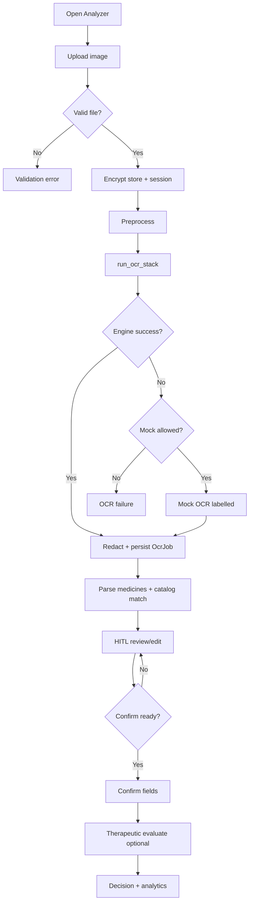

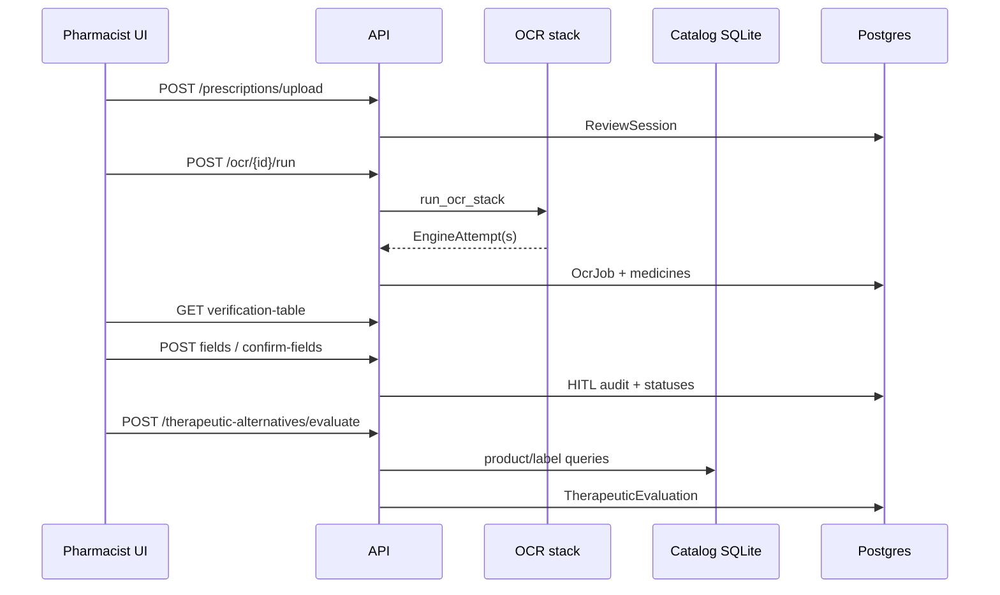

**Path variants**

| Path | Behaviour |
| ---- | --------- |
| Happy path | Vision/Tesseract/TrOCR succeeds → parse → Confirm → evaluate |
| Low confidence | TrOCR crop retry may run if enabled; pharmacist must still Confirm |
| OCR engine failure | Next fallback; else mock if allowed; else error |
| No drug match | Formulary unmatched; pharmacist selects catalogue option |
| Ambiguous match | Suggestions list; pharmacist chooses |
| Pharmacist correction | Field POST updates pharmacist_* columns + audit |
| Validation error | Upload rejected |
| System error | HTTP error; job status reflects failure where modelled |

---

## 13. OCR and image-processing pipeline

### Supported inputs and limits
- Upload max: `MAX_UPLOAD_BYTES` default 10 MiB (**Configuration-verified**: `config.py`).
- Types: image uploads validated on API path (JPEG/PNG family expected; exact allow-list **Code-verified** in upload/validate handlers).
- Preprocess: deskew, ink isolate, binarise, sharpen, `OCR_PREPROCESS_MAX_SIDE`.

### Engine matrix

| Engine | Role in production profile | Role in spec profile | Adapter evidence |
| ------ | -------------------------- | -------------------- | ---------------- |
| Google Vision | Primary | Fallback | `engines.py` Vision REST |
| Tesseract | Fallback | Fallback | `tesseract_adapter.py` |
| TrOCR | Optional crop retry on low-conf Vision lines | Primary | `engines.py` TrOCR crop |
| PaddleOCR | Optional detection assist (`ENABLE_PADDLE_DETECT`) | Optional | `engines.py` |
| Mock | Dev/last resort if allowed | Same | `_mock_document` |

**Is TrOCR genuinely primary?** Only when `OCR_PROFILE=spec`. Production default is Vision-primary (**Code-verified**).

**Hybrid consensus object:** exists (`consensus.py`) but optional via flag — not Spec-mandated.

**Per-engine preservation:** `OCR_PRESERVE_ENGINE_OUTPUTS` / `EngineAttempt` contract; research DQ1 aims to keep independent outputs.

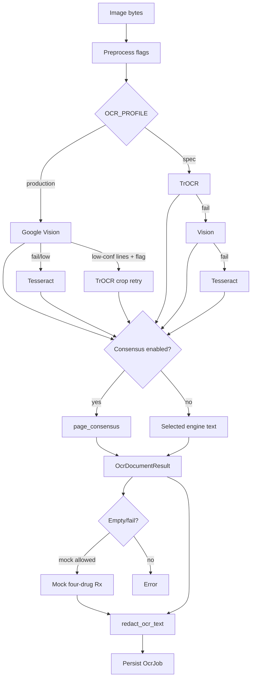

### OCR fallback decision tree

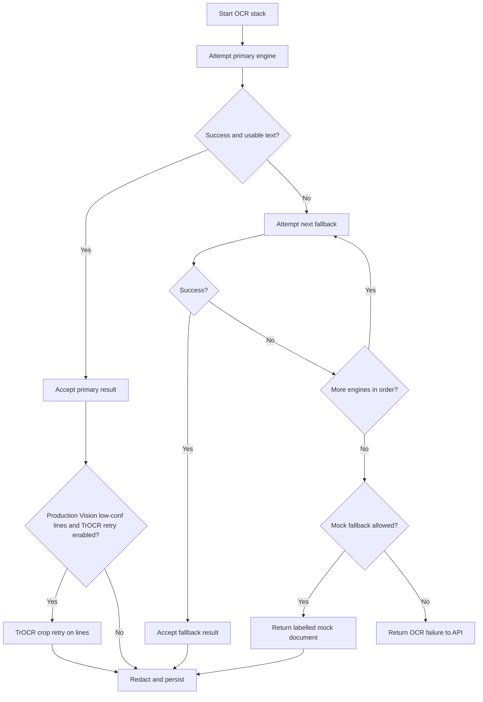

### OCR output schema (illustrative from models)
```json
{
  "id": "<uuid>",
  "session_id": "<uuid>",
  "engine": "google_vision",
  "status": "completed",
  "raw_text": "<redacted transcript>",
  "confidence": 0.0,
  "character_count": 0,
  "processing_ms": 0,
  "is_mock": false,
  "warnings_json": null,
  "pipeline_json": null
}
```
(**Code-verified** fields: `models/prescription.py` `OcrJob`.)

---

## 14. NLP, entity extraction and normalisation

- **Raw OCR text:** redacted then parsed by pipeline / `MedicalParserAdapter`.
- **Extraction style:** rule/line-oriented parsing with SIG field heuristics (not a full clinical NLP suite).
- **Drug names:** extracted then fuzzy-matched to catalogue aliases; Title Case display.
- **Strength / dose / route / frequency:** parser + HITL catalogue/SIG options; unit normalisation partial.
- **Indication:** primarily pharmacist/catalog selection, not reliable OCR extraction.
- **Spelling correction:** suggestion-based (RapidFuzz), not silent overwrite of OCR (R06 intent; auto-promotion risks noted).
- **Ambiguity:** multiple suggestions ranked; pharmacist chooses.
- **Manual correction:** pharmacist_* columns.

**Synthetic example (labelled synthetic):** OCR line `Amoxcillin 500mg PO TDS` → AI name may be misspelt → catalogue suggests `Amoxicillin` → pharmacist Confirms strength/dose/frequency from options.

**Evidence:** `pipeline.py`, `datasets/match.py`, `catalog_sig_options.py`, `salt_normalisation.py`, tests under `backend/tests/test_multiline_rx_parser.py`, `test_label_dose_extract.py`.

---

## 15. Drug knowledge and evidence pipeline

### Sources

| Source | Purpose | Format | Runtime use | Evidence |
| ------ | ------- | ------ | ----------- | -------- |
| FDA NDC | Product identity (NDC, proprietary/nonproprietary, form, route, manufacturer) | JSON (`drug-ndc-*.json`) | Ingested into SQLite products | `build_index` / `FDA_NDC_JSON_PATH` |
| FDA SPL / labels | Indications, dosage & admin, contraindications, warnings, etc. (label sections) | `drug-label-*.json` shards | `label_sections` keyword retrieval | `FDA_SPL_JSON_PATH` / DATA_DIR |
| DrugBank | Drug identifiers / names (and SMILES seed subset for MCS) | XML | Medicines with `drugbank_id` in catalogue | `DRUGBANK_XML_PATH` |

**Expected paths (config):** under `DATA_DIR` (compose mounts `./data`). Exact filenames resolved by settings defaults. If files missing, catalogue features degrade — **configuration-dependent**.

### Field provenance (critical honesty)

| Field | Typical source | Must NOT claim from NDC/DrugBank alone |
| ----- | -------------- | -------------------------------------- |
| Brand / generic / ingredient | Catalogue (NDC/DrugBank ingest) | — |
| Strength / dosage form / route (product) | NDC/product rows | — |
| Product NDC | NDC | — |
| Indications / warnings / contraindications / interactions text | SPL label sections when present | — |
| “ONE tablet” / “TWICE daily” style SIG | **Curated HITL/SIG templates or SPL dosage excerpts**, not DrugBank product master | Dose/frequency templates |

### ETL (conceptual)

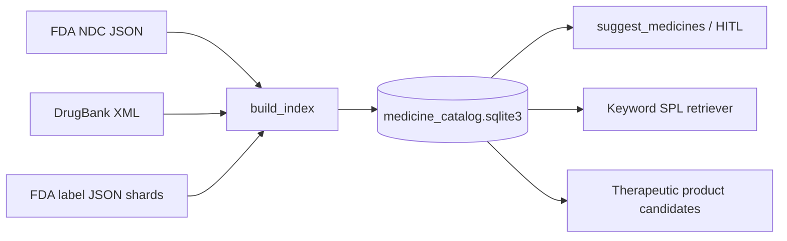

**Update strategy:** rebuild catalogue offline; app reads SQLite. **Caching:** process-local catalogue access patterns (**Inferred**). **Dedup/join:** performed at build time into canonical medicines/products/aliases/label_sections (**Code-verified** build modules; row counts Data-verified when probe succeeds).

### Drug-matching flow (runtime)

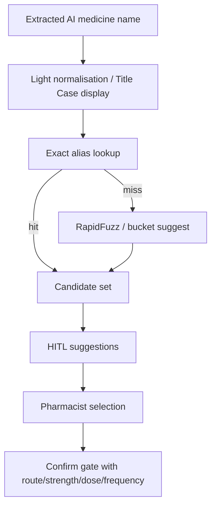

### Data lineage

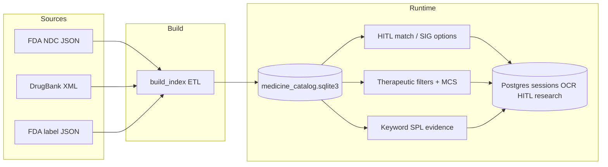

**Licence/access:** follow upstream FDA/DrugBank terms as documented by those providers; project does not embed licence text in runtime (**Document-only** caution).

---

## 16. Clinical decision-support and safety specification

| Capability | Status | Notes / evidence |
| ---------- | ------ | ---------------- |
| Drug identity verification | Partially implemented | Catalogue match + pharmacist Confirm |
| Strength / route verification | Partially implemented | Cascade greens + catalogue options |
| Indication evidence | Partially implemented | SPL keyword / pharmacist verified indication |
| Contraindication warning | Partially implemented | Label section retrieval when available — not a full CDS rules engine |
| Allergy check | Partially implemented | Request context filters in therapeutic path |
| Age / pregnancy warning | Partially implemented | Context fields; not comprehensive obstetric CDS |
| Dose-range check | Partially implemented / limited | Options/templates; not full dosing CDS |
| Drug–drug interaction | Not implemented / Not verifiable as dedicated module | — |
| Duplicate-therapy check | Not implemented / Not verifiable | — |
| Evidence-source display | Implemented | Provenance chips / sources endpoints |
| Confidence-based escalation | Partially implemented | OCR confidence + Confirm gate; not full escalation workflow |
| Pharmacist confirmation gate | Implemented | `confirm_when_ready`; blocks mock by default |

**Fail-safe:** prefer block Confirm / show insufficient evidence rather than invent facts (Groq default off; RAG insufficient string). **Automation bias residual risk:** high confidence UI must not be treated as clinical truth.

PharmaAssist does **not** diagnose, prescribe or autonomously validate medication safety end-to-end.

---

## 17. Human-in-the-loop pharmacist workflow

Pharmacist sees AI-extracted fields, catalogue suggestions, evidence/warnings, and editable pharmacist values. Confirm requires required fields matched/selected. Rejection/override reasons more complete on therapeutic decisions than every SIG edit (R05 gap).

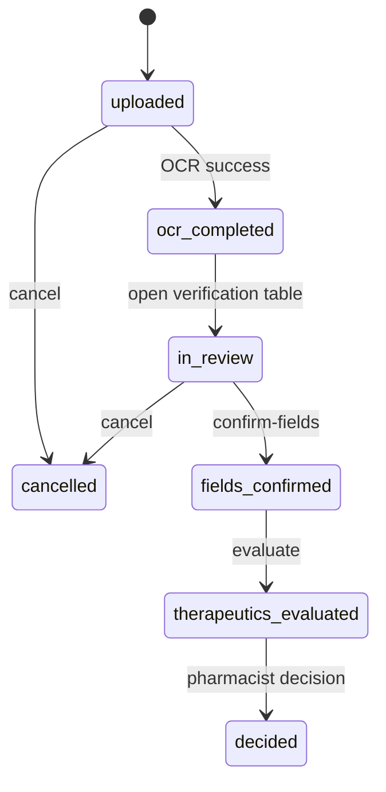

*(Session status strings are pragmatic; a formal enum state machine is only partially aligned — R04.)*

### Field-level review matrix

| Field | Editable | AI value stored | Pharmacist value | Engine provenance | Catalogue match |
| ----- | -------- | --------------- | ---------------- | ----------------- | --------------- |
| Medicine name | Yes | `ai_medicine_name` | `pharmacist_medicine_name` | Partial | Yes |
| Strength | Yes | `ai_strength` | `pharmacist_strength` | Partial | Yes |
| Route | Yes | `ai_route` | `pharmacist_route` | Partial | Yes |
| Dose | Yes | `ai_dose` | `pharmacist_dose` | Partial | Templates/options |
| Frequency | Yes | `ai_frequency` | `pharmacist_frequency` | Partial | Templates/options |
| Indication | Yes | Limited AI | `pharmacist_verified_indication` | Weak | Catalog pick |
| Duration | Yes | `ai_duration` | `pharmacist_duration` | Weak | Limited |

### Research evidence sufficiency for OCR accuracy studies
Persisted production path provides session id, engine, raw OCR text, pharmacist corrections, statuses, timestamps, HITL audit. Dedicated DQ1 tables add CER/WER runs vs evaluation-case GT. Gaps: per-field engine provenance; study GT population; character/word counts at field grain may need export normalisation.

---

## 18. API specification

Base path: `/api/v1` (mounted from `backend/app/main.py` / router). Authentication: Bearer access JWT unless noted. Authorisation: role dependencies.

### Catalogue (selected endpoints)

| Method | Path | Purpose | Authz | Evidence |
| ------ | ---- | ------- | ----- | -------- |
| POST | `/auth/login` | Issue tokens | Public | `auth.py` |
| POST | `/auth/refresh` | Rotate tokens | Refresh | `auth.py` |
| POST | `/auth/logout` | Invalidate refresh | Auth | `auth.py` |
| GET | `/auth/me` | Current user | Auth | `auth.py` |
| POST | `/auth/forgot-password` | Temp password | Public | `auth.py` |
| POST | `/auth/change-password` | Change password | Auth | `auth.py` |
| POST | `/auth/register/complete` | Pharmacist registration | Public | `registration.py` |
| GET | `/research/pis/current` | PIS document | Public/auth per impl | `consent_docs.py` |
| GET | `/research/consent/current` | Consent document | Public/auth per impl | `consent_docs.py` |
| GET | `/admin/dashboard` | Admin dashboard | Admin | `admin.py` |
| GET | `/admin/registrations` | List registrations | Admin | `admin.py` |
| POST | `/admin/registrations/{id}/approve` | Approve | Admin | `admin.py` |
| POST | `/admin/registrations/{id}/reject` | Reject | Admin | `admin.py` |
| GET/POST | `/admin/retention` / `.../purge` | Retention | Admin | `admin.py` |
| GET | `/rbac/{role}` | RBAC ping | Role | `rbac_check.py` |
| POST | `/prescriptions/upload` | Upload | Pharmacist | `prescriptions.py` |
| GET | `/prescriptions/{session_id}` | Session | Pharmacist | `prescriptions.py` |
| GET | `/prescriptions/{session_id}/image` | Image bytes | Pharmacist | `prescriptions.py` |
| DELETE | `/prescriptions/{session_id}/temporary-file` | Delete temp | Pharmacist | `prescriptions.py` |
| POST | `/prescriptions/{session_id}/cancel` | Cancel | Pharmacist | `prescriptions.py` |
| POST | `/ocr/{session_id}/run` | Sync OCR | Pharmacist | `prescriptions.py` |
| POST | `/ocr/{session_id}/run-async` | Async OCR | Pharmacist | `prescriptions.py` |
| GET | `/ocr/jobs/{job_id}` | Job poll | Pharmacist | `prescriptions.py` |
| GET | `/ocr/{session_id}/results` | Latest results | Pharmacist | `prescriptions.py` |
| GET | `/reviews/{session_id}/medicines` | Medicines | Pharmacist | `prescriptions.py` |
| POST | `/reviews/{session_id}/medicines/{id}/verify` | Verify medicine | Pharmacist | `prescriptions.py` |
| GET | `/reviews/{session_id}/verification-table` | HITL table | Pharmacist | `clinical.py` |
| POST | `/reviews/{session_id}/medicines/{id}/fields` | Correct field | Pharmacist | `clinical.py` |
| POST | `/reviews/{session_id}/medicines/{id}/confirm-fields` | Confirm | Pharmacist | `clinical.py` |
| POST | `/reviews/{session_id}/submit` | Submit review | Pharmacist | `clinical.py` |
| GET | `/reviews/{session_id}/hitl-audit` | Audit | Pharmacist | `clinical.py` |
| GET | `/reviews/{session_id}/alternatives` | Legacy alternatives | Pharmacist | `clinical.py` |
| POST | `/reviews/{session_id}/alternatives/{id}/feedback` | Feedback | Pharmacist | `clinical.py` |
| GET | `/formulary/drugs` | Formulary list | Pharmacist | `clinical.py` |
| GET | `/formulary/suggest` | Formulary suggest | Pharmacist | `clinical.py` |
| GET | `/research/evaluation-snapshot` | Snapshot | Reviewer | `clinical.py` |
| POST | `/therapeutic-alternatives/evaluate` | Evaluate | Pharmacist | `therapeutic_alternatives.py` |
| GET | `/therapeutic-alternatives/{id}` | Get evaluation | Pharmacist | `therapeutic_alternatives.py` |
| GET | `/therapeutic-alternatives/{id}/sources` | Sources | Pharmacist | `therapeutic_alternatives.py` |
| POST | `/therapeutic-alternatives/{id}/decision` | Decision | Pharmacist | `therapeutic_alternatives.py` |
| GET | `/prescriptions/{id}/analytics` | Analytics | Pharmacist | `analytics.py` |
| GET | `/prescriptions/{id}/analytics/export` | Export | Pharmacist | `analytics.py` |
| GET | `/catalog/status` | Catalogue status | Pharmacist | `datasets.py` |
| GET | `/catalog/overview` | Overview | Pharmacist | `datasets.py` |
| GET | `/catalog/lookup` | Lookup | Pharmacist | `datasets.py` |
| POST | `/catalog/suggest` | Suggest | Pharmacist | `datasets.py` |
| POST | `/ocr/validate-image` | Validate image | Pharmacist | `datasets.py` |
| * | `/research/eval/*` | DQ1–DQ4 harness | Reviewer | `research_eval.py` |

**Rate limiting:** tests reference rate limit module (`test_rate_limit.py`); treat as Partially implemented / present in tests — confirm middleware in `main.py` for production claims.

**Error responses:** FastAPI HTTPException patterns; validation via Pydantic schemas.

```mermaid
flowchart LR
  UI[Frontend] --> Auth[/auth/*]
  UI --> Rx[/prescriptions|/ocr|/reviews]
  UI --> TE[/therapeutic-alternatives]
  UI --> Cat[/catalog]
  UI --> RE[/research/eval]
  UI --> Adm[/admin]
```

---

## 19. Database and persistence specification

- **Engine:** PostgreSQL (app) + SQLite (catalogue).
- **ORM:** SQLAlchemy 2.x.
- **Migrations:** Alembic revisions `0001_phase1b` … `0012_research_evaluation`.

### Mermaid ERD (implemented core)

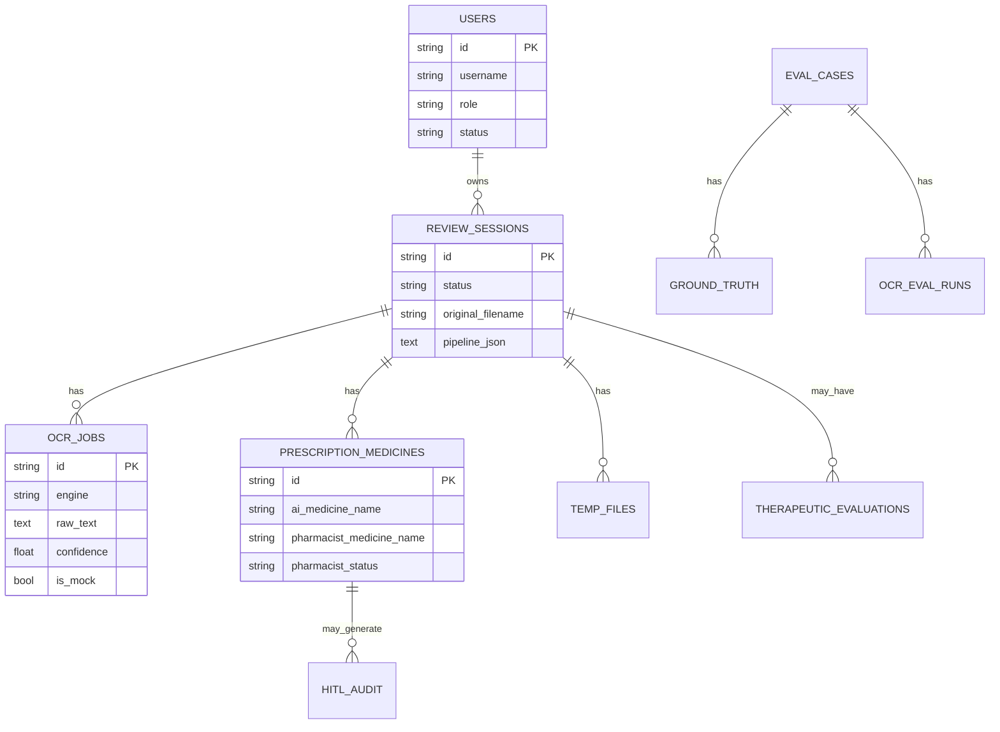

### Data dictionary (selected — PostgreSQL)

| Table | Field | Type | Required | Key/Constraint | Default | Meaning | Source | Sensitive? | Evidence |
| ----- | ----- | ---- | -------- | -------------- | ------- | ------- | ------ | ---------- | -------- |
| auth.users | id | UUID str | Yes | PK | uuid | User id | System | No | `models/auth.py` |
| auth.users | username | str | Yes | unique | — | Login name | User | Yes (identifier) | auth.py |
| auth.users | password_hash | str | Yes | — | — | Argon2 hash | User | Yes | auth.py |
| auth.users | role | str | Yes | — | — | Role enum | Admin/seed | No | enums.py |
| auth.users | encrypted_pharmacist_registration_id | str | No | — | — | Encrypted reg id | Registration | Yes | auth.py |
| prescription.review_sessions | status | str | Yes | — | uploaded | Lifecycle | System | No | prescription.py |
| prescription.review_sessions | original_filename | str | Yes | — | — | Upload name | Upload | Possible | prescription.py |
| ocr.ocr_jobs | raw_text | text | Yes | — | — | Redacted OCR | OCR | Possible PHI residual | prescription.py |
| ocr.ocr_jobs | is_mock | bool | Yes | — | True model default | Mock flag | OCR | No | prescription.py |
| prescription.prescription_medicines | ai_* / pharmacist_* | str | varies | — | — | HITL fields | OCR/HITL | Possible | prescription.py |
| security.temporary_file_records | object_key | str | Yes | — | — | Encrypted blob key | Storage | Yes (image) | prescription.py |

Catalogue SQLite tables (medicines, products, aliases, label_sections, meta, …) are **Data-verified** when `data/medicine_catalog.sqlite3` is present; exact counts depend on local build.

**Soft delete:** temporary files use `deleted_at`; sessions use `cancelled_at` / `temporary_deleted_at`.

---

## 20. Data-flow diagrams

### 20.1 Context-level DFD

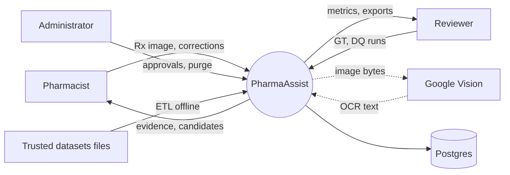

### 20.2 Level-0 DFD

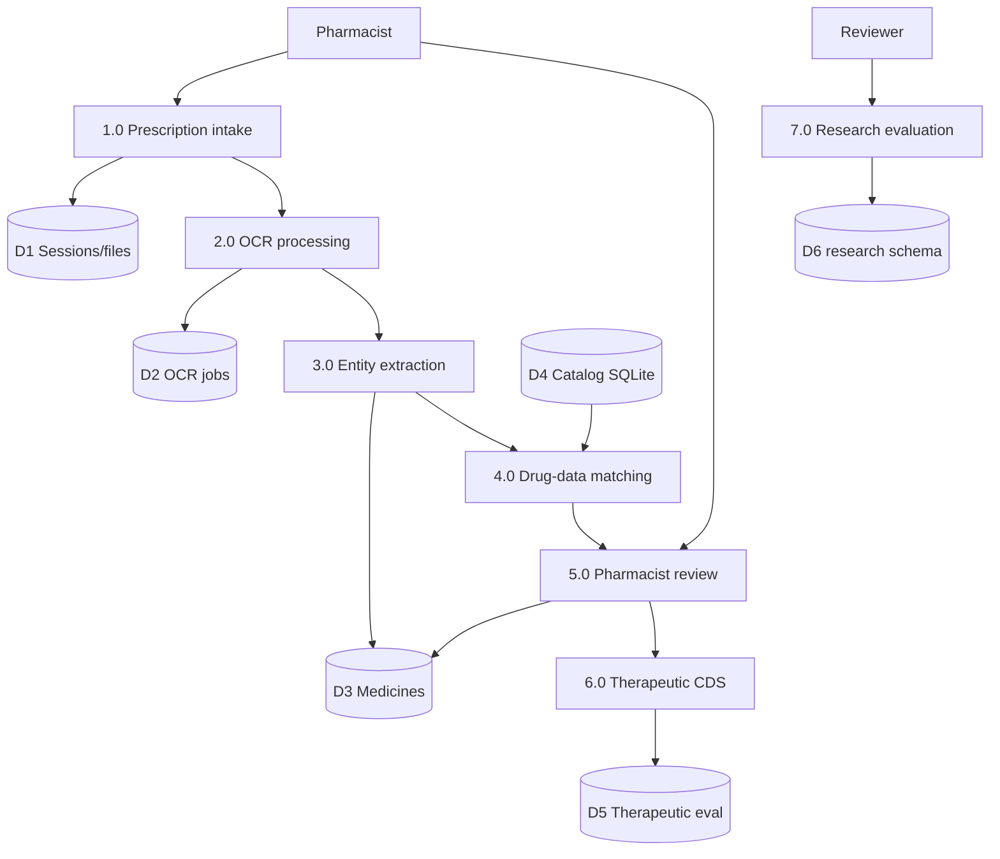

### 20.3 Level-1 OCR DFD

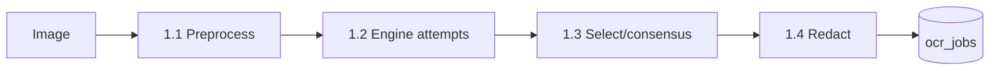

### 20.4 Level-1 drug-matching DFD

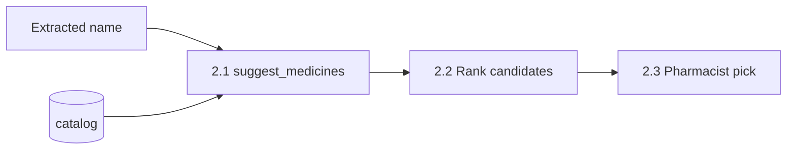

### 20.5 Level-1 HITL-verification DFD

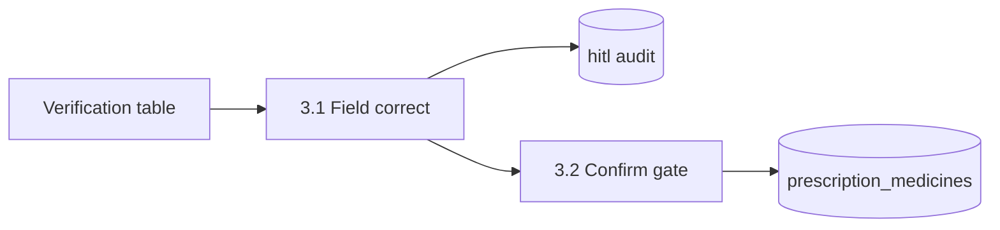

### 20.6 Level-1 research-evaluation DFD

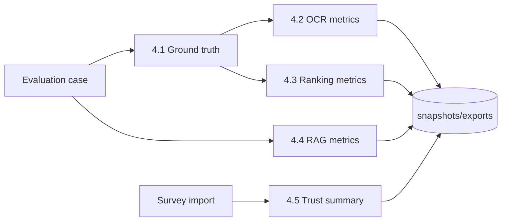

---

## 21. Data classification, privacy and PII

| Question | Finding | Evidence classification |
| -------- | ------- | ----------------------- |
| Patient name collected? | Not as a first-class patient entity; OCR may contain names before redaction | Partially — redaction attempted (`ocr/privacy.py`) |
| Age / sex / allergies / pregnancy? | May appear in therapeutic **request context**; not durable patient master table | Code-verified API body; persistence of context **verify per therapeutic models** |
| Prescription images stored? | Yes, encrypted temporary blobs | Code-verified storage_service |
| Raw OCR text stored? | Yes, in `ocr.ocr_jobs.raw_text` after redaction | Code-verified |
| Pharmacist identity stored? | Username; user id FK on sessions; encrypted registration id | Code-verified |
| IP / session logged? | Login history exists; IP capture **verify field list in LoginHistory** | Partially / inspect `models/auth.py` |
| PII redaction? | `redact_ocr_text` patterns | Code-verified |
| Retention | `TEMP_FILE_RETENTION_HOURS` default 24h; delete on confirm flags | Configuration-verified |
| Anonymisation | Research uses pseudonyms; production filenames may retain original upload name | Mixed |

**Do not claim “no PII is stored”.** Identifiers and potentially residual OCR content may persist.

| Data element | Source | Purpose | Processing | Storage | Retention | External transfer | Risk | Control |
| ------------ | ------ | ------- | ---------- | ------- | --------- | ----------------- | ---- | ------- |
| Rx image | Pharmacist upload | OCR | AES-GCM encrypt | Local storage | ~24h / on confirm | Possible to Google Vision | High | Encryption, retention, auth |
| OCR text | Engines | HITL/eval | Redact | Postgres ocr_jobs | With session | Vision path already external | Medium | Redaction, RBAC |
| Username | User | Auth | Hash password separately | auth.users | Account life | No | Medium | Argon2, lockout |
| Registration id | Applicant | Study linkage | Field encryption | users column | Account life | No | Medium | FIELD_ENCRYPTION_KEY |
| Survey responses | Forms import | DQ4 | Pseudonym | research tables | Study | Import only | Low if pseudonymised | Reviewer gate |
| Catalogue data | FDA/DrugBank | Matching | ETL | SQLite | Rebuild | No (local) | Low | Licence compliance |

---

## 22. Security specification

| Control | Status | Evidence |
| ------- | ------ | -------- |
| Authentication | JWT access + refresh rotation | `security/tokens.py`, auth API |
| Password handling | Argon2 parameters in Settings | `config.py` |
| Session handling | Refresh token family / logout | auth models |
| RBAC | `require_roles` dependencies | `security/rbac.py` |
| CORS | `CORS_ORIGINS` | `config.py` / main |
| CSRF | SPA bearer pattern; classic CSRF limited | Inferred |
| Input validation | Pydantic + upload checks | API schemas |
| File-upload security | Size/type; encrypted store | upload + storage |
| MIME validation | Present on validate/upload | datasets/prescriptions |
| Malware scanning | **Not found** | Not implemented |
| Injection prevention | ORM parameterisation | SQLAlchemy |
| Secrets management | Env vars; **dev defaults exist — must change** | `config.py` defaults |
| Encryption in transit | Depends on deployment TLS termination | Not verifiable in repo alone |
| Encryption at rest | App-level AES-GCM for files; DB disk encryption not app-managed | storage/encryption |
| Audit trails | HITL + therapeutic + login | models |
| Rate limiting | Tested; confirm middleware wiring | `test_rate_limit.py` |
| Error disclosure | APP_DEBUG influences | config |
| Backup/recovery | Ops concern; compose volume `postgres_data` | docker-compose |

### Concise threat model

| Threat | Attack path | Asset | Mitigation | Residual | Recommended | Priority |
| ------ | ----------- | ----- | ---------- | -------- | ----------- | -------- |
| Stolen JWT | XSS/token theft | Sessions | Short-ish access TTL configurable; HTTPS needed | Medium | HttpOnly cookie hardening / CSP | High |
| Vision data leakage | Image sent to Google | Rx image | Optional engine; minimise; ethics | High if real Rx | Synthetic-only for study; DPA | Critical for real PHI |
| Mock Confirm misuse | Dev mock treated as real | Clinical decision | `HITL_ALLOW_MOCK_CONFIRM` default false | Low | Keep false in any pilot | High |
| Weak secrets | Default JWT/encryption keys | All | Change in `.env` | High if defaults left | Secret rotation | Critical |
| Upload exploit | Malicious image | Host | Size/type limits; no malware scan | Medium | ClamAV/quarantine | Medium |

---

## 23. Research-question and requirement traceability

Approved DQ wording is taken from `docs/research_question_alignment.md` (not rewritten).

### 23.1 Requirements traceability matrix (abridged — see also `specification_traceability_matrix.md`)

| Requirement ID | Approved requirement | Source/page | Implementation status | UI evidence | Backend evidence | Data evidence | Test evidence | Gap | Recommendation | Acceptance test |
| -------------- | -------------------- | ----------- | --------------------- | ----------- | ---------------- | ------------- | ------------- | --- | -------------- | --------------- |
| R01 | TrOCR primary + Vision + Tesseract | Spec O1/A8/B1 | Implemented (dual-path) | Analyzer OCR; Research DQ1 | `ocr/engines.py` | EngineAttempt | `test_r01_ocr_engines.py` | Env weights/binaries | Keep dual-path | Spec profile order asserted |
| R02 | Preprocess | Spec | Implemented | — | `preprocess.py` | — | `test_ocr_preprocess.py` | — | Keep | Flags alter pipeline hash |
| R03 | Structured extraction | Spec | Partially implemented | VerificationTable | `pipeline.py` | medicines columns | parser tests | Indication/duration weak | Persist field provenance | Schema includes engine per field |
| R04 | HITL before recommendations | Spec | Implemented | Analyzer Confirm | `field_verification.py` | statuses | hitl tests | Enum labels | Document states | Confirm blocks evaluate |
| R20 | WER/CER | Spec O6 | Implemented | Research panel | `ocr_metrics.py` | ocr_evaluation_runs | research_evaluation tests | Study GT empty | Deposit GT | Fixture WER matches |
| R24 | Likert DQ4 | Spec | Implemented (import-only) | DQ4 tab | survey import API | pharmacist_survey_responses | — | n=0 until Forms | External collect n=5 | Import without PII |
| R27 | Streamlit/HF deploy | Spec B1 | Conflicting | React UI | FastAPI/Docker | — | — | Platform conflict | Document DSR — do not re-platform | Compose healthy |
| R29 | 143/10 claims | Eval lore | Not verifiable | Must show not verifiable | claim helpers | incomplete | — | No evidence | Do not claim | UI string Not verifiable |

### 23.2 Research-question traceability matrix

| RQ/DQ ID | Exact question | Independent variable | Dependent variable | Metric | Data captured | Implementation | Evidence | Answerable? | Gap |
| -------- | -------------- | -------------------- | ------------------ | ------ | ------------- | -------------- | -------- | ----------- | --- |
| DQ1 | How accurately does TrOCR extract medicine names and dosage information (WER, CER)? | OCR engine / profile | Extraction accuracy | WER, CER, name P/R/F1, latency | GT + ocr_evaluation_runs | Dual-path + DQ1 runner | `research_question_alignment.md`, research_eval | **Not yet** (harness yes, study GT incomplete) | Load pharmacist GT; run Spec profile |
| DQ2 | How effectively does RDKit MCS identify pharmacist-validated generic/candidate alternatives (P@K, R@K)? | Rules vs rules+MCS | Ranking quality | P@1, P@3, R@3, invalid rate | Gold standards | Dual lists + DQ2 API | same | **Not yet** | Complete gold set |
| DQ3 | How does FAISS RAG affect semantic agreement and factual reliability (BERTScore + OpenFDA)? | Retriever type | Groundedness / similarity | citation coverage, unsupported claims, BERTScore | rag_evaluation_runs | Keyword prod + experimental FAISS | same | **Weakly / not yet** | Enable FAISS+bert-score; study set |
| DQ4 | Impact of SHAP/LIME + source attribution on trust/transparency/perceived accuracy | Explanation condition A/B/C | Likert constructs | Means/SD | survey import | Import-only + summary | same | **Not yet** | External Forms responses |

### 23.3 Feature-to-research mapping
- F05–F08, F15–F16 → DQ1
- F11, F13, therapeutic MCS → DQ2
- SPL retrievers / DQ3 runner → DQ3
- XAI conditions + survey import → DQ4
- F12 HITL → ground truth factory for DQ1/DQ2

### 23.4 Unanswerable or weakly supported questions
All DQ1–DQ4 are **harness-ready but not study-answered**. Any claim of completed accuracy figures, 143 prescriptions, or ten pharmacists is **Not verifiable**.

---

## 24. Evaluation methodology

### Character Error Rate (CER)
- **Definition:** normalised edit distance at character level between prediction and ground truth.
- **Formula:** \(\mathrm{CER} = \frac{S+D+I}{N}\) where \(N\) is number of characters in the reference (implementation details in `ocr_metrics.character_error_rate`).
- **Unit:** string field or full transcript per runner configuration.
- **Prediction / GT:** OCR engine output vs pharmacist GT record.
- **Code:** `backend/app/services/research_eval/ocr_metrics.py`.
- **Dashboard:** Research Evaluation DQ1 tab.

### Word Error Rate (WER)
- **Formula:** \(\mathrm{WER} = \frac{S+D+I}{N_{words}}\) (`word_error_rate`).
- Same evidence path as CER.

### Exact match / drug-name P/R/F1
Implemented in DQ1 entity helpers (`entity_prf`). Aggregation micro/macro — verify in code before publishing figures.

### Ranking P@K / R@K
`ranking_metrics.py` for DQ2.

### BERTScore
Optional (`ENABLE_BERTSCORE`); if dependency missing, status should surface unavailable — not silent zero.

### Confidence calibration / pharmacist agreement / usability
Not fully productised as formal psychometrics beyond DQ4 Likert import.

**Known methodological risks:** empty GT; case/punctuation; using corrected text as both prediction and truth; mixing engines across unequal samples; simulated engine noise in offline DQ1 path — must be labelled when used.

---

## 25. Research dataset and experimental design

| Item | Finding |
| ---- | ------- |
| Planned sample (Spec) | 25–30 synthetic prescriptions; five pharmacists (`specification_manifest.json`) |
| Seed cases in repo | `data/research_evaluation/` (e.g. SYN cases / templates) — count verify locally |
| 143 / 10 pharmacists | **Not verifiable** |
| Synthetic vs real | Study design synthetic-oriented; upload path can accept any image |
| Ground-truth process | Pharmacist Confirm + research GT APIs |
| Inter-rater agreement | **Not found** as computed metric module |
| Engine assignment | DQ1 multi-engine runner; production profile separate |
| Model/version capture | Partial (engine id strings); weight hashes **Not verifiable** comprehensively |
| Data split / leakage | Offline sim path risks; document when used |
| Statistical limitations | Small n planned; no inferential claims without methodology |

**Do not fabricate experimental results.**

---

## 26. Evaluation dashboard and statistics specification

| Display | Definition | Calculation | Data source | RQ | Concerns |
| ------- | ---------- | ----------- | ----------- | -- | -------- |
| DQ1 WER/CER cards | Error rates by engine | Server metrics | `ocr_evaluation_runs` | DQ1 | Empty until runs |
| Engine thesis / framing banners | Explains dual-path roles | Static copy + API framework | `/dq1` framework endpoint if present | DQ1 | Must not imply completed study |
| DQ2 P@K | Ranking quality | Server | recommendation_* tables | DQ2 | Needs gold |
| DQ3 groundedness | Citation/unsupported | Server | rag_evaluation_runs | DQ3 | BERTScore optional |
| DQ4 means/SD | Trust constructs | Server summary | survey responses | DQ4 | Import-only |
| Session analytics | HITL/OCR operational stats | Server analytics_json | review_sessions | Ops | Not Spec RQ results |
| Availability chips | Data readiness | Server status | `/research/eval/status` | All | Must not show fake zeros |

Hard-coded demo metrics should not be presented as study outcomes. Client-side charts, if any, must bind to API payloads (**verify in ResearchEvaluationPanel**).

---

## 27. State models and business rules

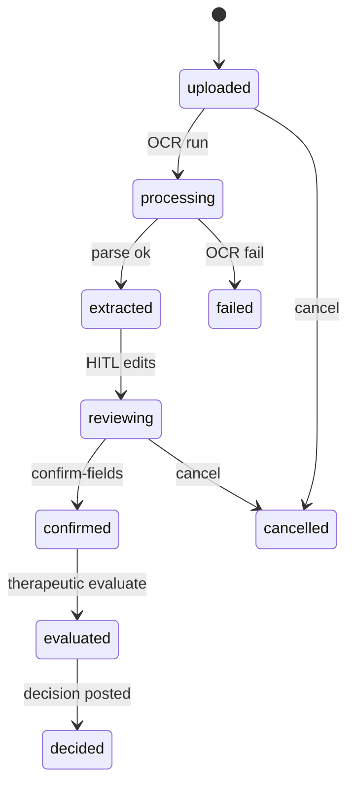

| Rule ID | Rule | Trigger | Input | Outcome | Exception | Evidence |
| ------- | ---- | ------- | ----- | ------- | --------- | -------- |
| BR01 | Confirm requires required field greens | confirm-fields | medicine fields | confirmed / 4xx | incomplete fields | `confirm_when_ready` |
| BR02 | Mock OCR cannot Confirm by default | confirm | is_mock | reject | `HITL_ALLOW_MOCK_CONFIRM` | field_verification |
| BR03 | Therapeutic evaluate uses confirmed medicines when flag set | evaluate | session medicines | candidates | unconfirmed skipped | therapeutic_alternatives.py |
| BR04 | MCS only after mandatory filters | scoring | candidates | filtered list | filter reject reasons | mandatory_filters.py |
| BR05 | Research eval reviewer-only | any /research/eval | JWT role | 403 else | — | research_eval.py |
| BR06 | Temp files expire | purge/startup | age hours | delete | — | retention settings |

---

## 28. Error handling and resilience

| Case | Handling |
| ---- | -------- |
| Unsupported / oversized file | Handled — validation errors |
| Corrupt image | Partially — engine/preprocess failures |
| Empty OCR | Handled via fallback/mock/error path |
| Low confidence | Partially — retry flags; HITL still required |
| OCR timeout | Partially — depends on HTTP client timeouts |
| Missing Vision credentials | Fallback / mock / error (config-dependent) |
| Dataset unavailable | Catalogue status endpoints; degraded matching |
| No / multiple drug matches | Suggestions + pharmacist choice |
| DB failure | API 500 / health degraded (health tests flaky — see §32) |
| Invalid pharmacist input | Validation errors on field POST |
| Duplicate submission | Partially — idempotency **Not fully verified** |
| Network interruption | Frontend error states |
| Backend unavailable | UI error |

---

## 29. Logging, monitoring and auditability

- Logger: standard Python logging in services; OCR logs engine id/status/ms **without raw text** (`engines.py` docstring/practice).
- Request IDs: **Not verifiable** as global middleware correlation ids without further inspection of `main.py`.
- Audit: HITL events, therapeutic audit, login history, research snapshots.
- Health: `/health` endpoint (tests currently failing AttributeError in local run — investigate before relying).
- Metrics: processing_ms on OCR jobs; research latency fields.
- Log retention: host/ops concern — **Not found** as app policy beyond temp files.

---

## 30. Configuration and environment

| Variable | Component | Required? | Purpose | Default (name only / safe) | Failure behaviour | Security classification | Evidence |
| -------- | --------- | --------- | ------- | --------------------------- | ----------------- | ----------------------- | -------- |
| DATABASE_URL | API | Yes (prod) | Postgres DSN | Dev DSN in Settings | Startup/DB errors | Secret | config.py |
| JWT_SECRET_KEY | API | Yes | Sign JWT | Dev default must change | Weak auth | Secret | config.py |
| FIELD_ENCRYPTION_KEY | API | Yes | Encrypt fields/files | Dev default must change | Crypto fail/weak | Secret | config.py |
| GOOGLE_VISION_API_KEY / GOOGLE_APPLICATION_CREDENTIALS | OCR | For Vision | Cloud OCR | Empty | Fallback/mock | Secret | config.py |
| OCR_PROFILE | OCR | No | production\|spec | production | Wrong research posture if mis-set | Low | config.py |
| OCR_PRIMARY / OCR_FALLBACK_ORDER | OCR | No | Engine order | Vision / tesseract | — | Low | config.py |
| OCR_SPEC_PRIMARY / OCR_SPEC_FALLBACK_ORDER | OCR | No | Spec order | trocr / vision,tesseract | — | Low | config.py |
| OCR_ALLOW_MOCK_FALLBACK | OCR | No | Allow mock | Env-dependent | Synthetic OCR | Medium | config.py |
| HITL_ALLOW_MOCK_CONFIRM | HITL | No | Allow Confirm on mock | false intended | Blocks Confirm | Medium | config.py |
| MEDICINE_CATALOG_DB / DATA_DIR / FDA_* / DRUGBANK_XML_PATH | Data | For catalogue | Paths | Under DATA_DIR | Degraded match | Low | config.py |
| MAX_UPLOAD_BYTES | API | No | Upload cap | 10MiB | Reject | Low | config.py |
| CORS_ORIGINS | API | Yes (prod) | CORS | Dev origins | Browser block | Medium | config.py |
| ENABLE_BERTSCORE / ENABLE_SPEC_* / GROQ_* | Research | No | Optional layers | mostly false/true mix | Feature off | Secret for Groq key | config.py |
| TEMP_FILE_RETENTION_HOURS | Privacy | No | Retention | 24 | Orphan files | Low | config.py |

**Precedence:** process env > `.env` (repo root via Settings) > coded defaults.

---

## 31. Build, deployment and operational specification

### Verified local commands (from README)

```powershell
docker compose up -d postgres
cd D:\Projects\PharmaAssist\backend
.\.venv\Scripts\Activate.ps1
alembic upgrade head
uvicorn app.main:app --reload --host 127.0.0.1 --port 8000
```

```powershell
cd D:\Projects\PharmaAssist\frontend
npm run dev
```

```powershell
docker compose up --build
```

- UI: http://127.0.0.1:8080 · API health: http://127.0.0.1:8000/health
- Catalogue build (documented): `python -m app.services.datasets.build_index` (**README-verified**; treat as required before full demo).

### Deployment topology

```mermaid
flowchart TB
  User[Browser] --> Web[web :8080]
  Web --> API[api :8000]
  API --> PG[(postgres :5432)]
  API --> Data[/data mount]
  API --> Stor[/storage mount]
```

Troubleshooting: missing catalogue; Vision key; Tesseract not installed; TrOCR model download; container name conflicts on Windows Docker.

---

## 32. Testing and quality assurance

| Test area | Existing tests | Coverage | Result if safely executed | Gap | Recommended test |
| --------- | -------------- | -------- | ------------------------- | --- | ---------------- |
| Health | `test_health.py` | Basic | **2 FAILED** (AttributeError) in inspection run 4 Aug 2026 | Health shape drift | Fix health schema/tests |
| OCR R01 | `test_r01_ocr_engines.py` | Dual-path | Passed in same run (subset) | Live engines | Contract tests keep |
| Research eval | `test_research_evaluation.py` | DQ APIs | Passed in subset | Study data | Golden fixtures |
| Clinical safety sprint1 | `test_sprint1_clinical_safety.py` | Salt/filters | Passed in subset | — | Keep |
| HITL / catalog / OCR privacy | multiple `test_hitl_*`, `test_ocr_*` | Broad unit/API | Not all re-run this session | — | CI green gate |
| Frontend | **None** | — | N/A | No suite | Component + e2e |
| Security/perf/a11y | Minimal/`test_rate_limit` | Low | Partial | — | Expand |

**Executed this audit:** `test_health` (fail×2) + `test_r01_ocr_engines` + `test_research_evaluation` + `test_sprint1_clinical_safety` → **46 passed, 2 failed** overall for that invocation.

---

## 33. Non-functional requirements

| Area | Explicit requirement | Observation | Recommendation |
| ---- | -------------------- | ----------- | -------------- |
| Performance | Upload 10MiB; OCR latency variable | Blocking sync OCR path exists | Prefer async for large images |
| Scalability | Single API process typical | No queue workers found | Add worker for OCR |
| Security/Privacy | Ethics 18274; encryption; RBAC | Dev secrets defaults | Harden before pilot |
| Explainability | Provenance + rule-based score | SHAP optional | Honest labelling |
| Reproducibility | Snapshots + engine ids | Model hash incomplete | Record model revisions |
| Clinical safety | HITL Confirm gate | Automation bias remains | Training + UI warnings |
| Accessibility | Not formally certified | MUI defaults | Audit §35 |

---

## 34. Performance and capacity

- Upload cap 10 MiB default.
- OCR may be CPU/GPU heavy (TrOCR/Paddle); Vision network-bound.
- Catalogue SQLite can be hundreds of MB — memory mapping / query cost matter.
- Model load cost amortised per process (**Inferred**).
- No invented benchmark latencies.
- Concurrency: uvicorn workers as deployed; sync OCR blocks worker.

---

## 35. Accessibility and usability review

**Observed (not certified):** MUI components provide baseline semantics; keyboard paths and contrast not formally tested in this audit; clinical Confirm should remain visually distinct from Cancel; charts in research panel need text alternatives. Mark all a11y statements as **observed**.

---

## 36. Dependency and third-party service register

| Dependency/service | Version | Purpose | Data received | Data transmitted | Licence | Operational risk | Evidence |
| ------------------ | ------: | ------- | ------------- | ---------------- | ------- | ---------------- | -------- |
| FastAPI/uvicorn/SQLAlchemy | pinned reqs | API/ORM | — | — | OSS | Low | requirements.txt |
| PostgreSQL 16 | compose | DB | App data | — | OSS | Medium | docker-compose |
| Google Vision | API | OCR | — | Rx images | Google ToS | High privacy | engines.py |
| Tesseract | system+pytesseract | OCR | images local | — | Apache-ish | Install drift | adapter |
| TrOCR/HF | optional | OCR | images local | model download | Model licences | Supply chain | engines.py |
| FDA NDC/SPL | files | Knowledge | — | — | FDA terms | Stale data | data/ |
| DrugBank | XML | Knowledge | — | — | DrugBank licence | Compliance | data/ |
| Groq | optional | LLM summarise | prompts/excerpts | text | Vendor | Hallucination | config flags |
| React/MUI/Vite | package.json | UI | — | — | OSS | Low | package.json |

---

## 37. Complete implementation-status matrix

| Area | Capability | Expected behaviour | Actual behaviour | Status | Evidence | User/research impact |
| ---- | ---------- | ------------------ | ---------------- | ------ | -------- | -------------------- |
| Auth | RBAC 3 roles | Role gates | Implemented | Implemented | rbac.py | Correct access |
| OCR | TrOCR primary (Spec) | Spec order | Spec profile only | Implemented but configuration-dependent | OCR_PROFILE | DQ1 alignment |
| OCR | Vision primary (ops) | Reliable OCR | Default production | Implemented | engines.py | Better ops OCR |
| OCR | Consensus | Hybrid merge | Optional flag | Implemented but configuration-dependent | consensus.py | Research optional |
| OCR | Mock | Dev only | May activate in dev | Mocked / config-dependent | engines.py | Must label |
| HITL | Confirm gate | Block until verified | Implemented | Implemented | field_verification | Safety |
| Data | Catalogue match | Fuzzy suggest | Needs SQLite build | Implemented but configuration-dependent | match.py | Core UX |
| CDS | DDI engine | Interactions | Not present | Not implemented | — | Do not claim |
| TE | MCS alternatives | After filters | Supporting score | Partially implemented | therapeutic/ | DQ2 |
| RAG | FAISS | Spec RAG | Experimental | Partially implemented | evidence_retrievers | DQ3 |
| XAI | SHAP primary | Spec | Rule-based primary | Partially implemented | xai modules | Honest UX |
| Eval | DQ dashboards | Answer RQs | Harness only | Partially implemented | Research panel | Not yet publishable results |
| Deploy | Streamlit/HF | Spec | Docker React/API | Deprecated Spec path / Conflicting | compose | Document DSR |
| UI | Settings page | Ops config | Not found | Not implemented | App.tsx | Env-based config |
| Tests | Frontend | Coverage | None | Not implemented | package.json | QA gap |

---

## 38. Gap analysis

| Gap ID | Area | Expected | Actual | Evidence | Impact | Severity | Recommended action |
| ------ | ---- | -------- | ------ | -------- | ------ | -------- | ------------------ |
| G01 | Architecture | Streamlit/HF | React/FastAPI/Docker | R27 | Spec mismatch | Medium | Document modification |
| G02 | OCR primary | TrOCR | Vision default | R01 | RQ wording vs ops | High | Use Spec profile for DQ1 |
| G03 | Study data | GT loaded | Incomplete | alignment doc | Cannot answer DQs | Critical | Deposit GT/gold/survey |
| G04 | Field provenance | Per-field engine | Incomplete | R03 | Weak OCR science | High | Persist provenance schema |
| G05 | 143/10 claim | Evidence | Missing | R29 | Academic integrity | Critical | Never claim |
| G06 | Health tests | Green | 2 failed | test_health | Ops blind spot | Medium | Fix immediately |
| G07 | Frontend tests | Present | Absent | package.json | Regression risk | High | Add Vitest/Playwright |
| G08 | DDI CDS | Often assumed | Missing | inventory | Overclaim risk | High | Scope honesty |
| G09 | Privacy claim | No PII | OCR/images/usernames | §21 | Ethics | High | Accurate privacy notice |
| G10 | BERTScore/FAISS | Always on | Optional | config | DQ3 weak | Medium | Enable for study runs |

---

## 39. Prioritised recommendations

### 39.1 Required before dissertation evaluation
| ID | Problem | Change | Rationale | Research impact | Safety | Modules | Priority | Complexity | Acceptance |
| -- | ------- | ------ | --------- | --------------- | ------ | ------- | -------- | ---------- | ---------- |
| REC-D1 | Spec vs as-built confusion | Submit this as-built + conflict register | Assessor clarity | High | — | docs | P0 | Low | Supervisor acknowledges dual-path |
| REC-D2 | Broken health tests | Fix `/health` contract | Trustworthiness | Medium | Ops | main/health | P0 | Low | pytest health green |
| REC-D3 | Overclaim risk | Remove/ban 143/10 language | Integrity | Critical | — | docs/UI | P0 | Low | Only Spec n=5/25–30 |

### 39.2 Required before research-data collection
| ID | Problem | Change | Priority |
| -- | ------- | ------ | -------- |
| REC-R1 | Empty GT | Load SYN cases + pharmacist GT | P0 |
| REC-R2 | DQ1 engine fairness | Freeze Spec profile + record versions | P0 |
| REC-R3 | DQ4 path | External Forms + import SOP | P0 |
| REC-R4 | Provenance gaps | Per-field OCR provenance | P1 |

### 39.3 Required before pilot deployment
Harden secrets; TLS; disable mock; malware scanning; a11y pass; monitoring; DPA for Vision; clinical safety sign-off that system is assistive only.

### 39.4 Required before production use
Formal clinical safety case; validated CDS rules; HA Postgres; WAF; pen-test; on-call; data retention legal review — **far beyond current artefact**.

### 39.5 Future enhancements
Queue-based OCR workers; stronger DDI; FAISS productionisation if beneficial; richer inter-rater metrics; patient-safe de-identification pipeline.

---

## 40. Acceptance criteria

- **UI:** Given pharmacist login, When navigating to `/analyzer`, Then upload and verification table are available.
- **API:** Given valid JWT pharmacist, When `POST /prescriptions/upload` with valid image, Then 200/201 with session id.
- **OCR:** Given Vision credentials, When OCR run, Then `OcrJob.is_mock=false` and engine recorded.
- **Fallback:** Given Vision failure and Tesseract available, When stack runs, Then Tesseract attempt recorded.
- **Provenance:** Given preserve flag, When multi-engine run, Then per-engine outputs retained for DQ1.
- **Drug matching:** Given catalogue present, When suggest called, Then ranked candidates return.
- **HITL:** Given incomplete greens, When Confirm, Then rejected; Given complete, Then confirmed.
- **Research metrics:** Given GT, When DQ1 run, Then CER/WER persisted.
- **Privacy:** Given confirm+delete flags, When confirmed, Then temp blob deleted within policy.
- **Security:** Given wrong role, When `/research/eval/status`, Then 403.
- **Deployment:** Given `docker compose up`, When healthy, Then web:8080 and api:8000 respond.

---

## 41. Risks and mitigations

| Risk | Likelihood | Impact | Current control | Residual | Mitigation |
| ---- | ---------- | ------ | --------------- | -------- | ---------- |
| Incorrect OCR | High | High | HITL Confirm | Medium | Multi-engine + training |
| Incorrect drug match | Medium | High | Suggestions not silent overwrite | Medium | Fail-closed templates |
| Dataset incompleteness/stale | Medium | Medium | Local rebuild | Medium | Dated catalogue badge |
| Automation bias | High | High | Assistive copy | High | UI warnings |
| Alert fatigue | Medium | Medium | Limited alerts | Medium | Tuned warnings |
| Over-reliance on confidence | High | High | Confirm gate | Medium | Calibrate/display carefully |
| PII leakage via Vision | Medium | Critical | Ethics/synthetic preference | High | Synthetic-only study |
| Model drift | Medium | Medium | Partial version strings | Medium | Pin hashes |
| Ground-truth bias | Medium | High | Single Confirm path | Medium | Dual review protocol |
| Small sample | High | High | Spec n=5 | High | Report limits |
| Config risk (mock on) | Medium | High | Flags | Medium | Prod checklist |

---

## 42. Future-state roadmap

| Phase | Focus | Explicitly not current |
| ----- | ----- | ---------------------- |
| Immediate stabilisation | Fix health tests; secret hygiene; mock off | — |
| Research-readiness | GT/gold/survey deposit; Spec OCR profile runs | Published accuracy claims |
| Pilot-readiness | TLS, monitoring, DPA, safety case lite | Hospital EHR integration |
| Production-readiness | Validated CDS, HA, pen-test | Autonomous dispensing |
| Long-term | Stronger NLP, DDI, FAISS-at-scale | Spec Streamlit re-platform |

---

## 43. Appendices

### A. Repository structure (selected)
`frontend/`, `backend/app/`, `backend/alembic/`, `backend/tests/`, `data/`, `docs/`, `storage/`, `infrastructure/postgres/`, `docker-compose.yml`, `README.md`.

### B. UI route register
See §10.

### C. API register
See §18.

### D. Database data dictionary
See §19 (extend from ORM models for full field lists in handover packs).

### E. Environment-variable register
See §30.

### F. Business-rule register
See §27.

### G. Error catalogue
HTTP 400 validation; 401/403 authz; 404 missing session; 409/422 where used; 500 infrastructure — exact bodies schema-dependent.

### H. Feature evidence index
F01–F22 → files cited in §11.

### I. Test evidence index
`backend/tests/*.py` (34 modules); frontend none.

### J. Diagram index
1 System context §7; 2 containers §9; 3 navigation §10; 4 E2E flowchart §12; 5 sequence §12; 6 OCR pipeline §13; 7 OCR fallback tree §13; 8 ETL §15; 9 drug-matching §15; 10 data lineage §15; 11 HITL state §17; 12 review state §27; 13 ERD §19; 14–18 DFDs §20; 19 deployment §31; 20 API dependency §18.

### K. Open questions
- Exact live row counts in catalogue on every machine.
- Whether LoginHistory stores IP.
- Full middleware list for rate limit/correlation ids.
- Git commit hash (tooling unavailable during audit).

### L. Unverified claims
143 prescriptions; ten pharmacists; any published WER/CER study result; production TLS; malware scanning; formal a11y certification.

### M. Documentation-generation limitations
Inspection used static code, existing docs, partial pytest, and configuration. Massive JSON/XML datasets were not fully loaded. Git metadata unavailable. No intrusive security testing. Application source code was **not** modified for this document.

---

## Document end

*Prepared through codebase inspection for academic and technical review. Executable implementation is the source of truth where documentation conflicts.*
